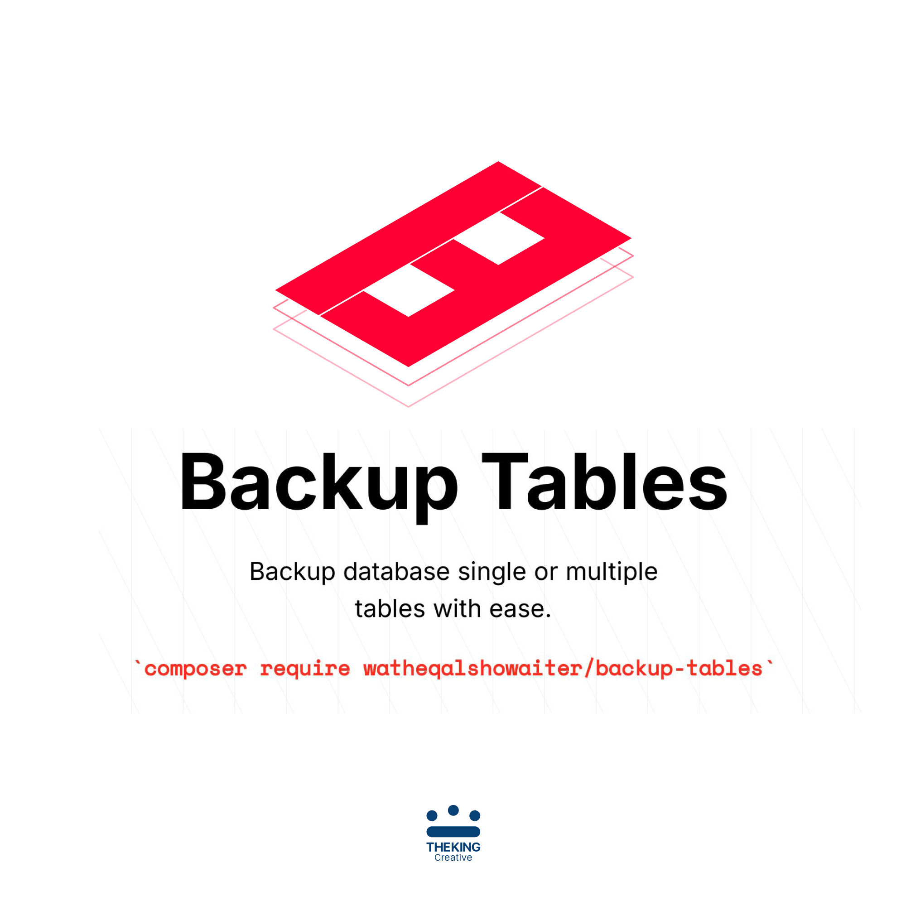

# Backup Tables

[](https://packagist.org/packages/watheqalshowaiter/backup-tables)
[](https://packagist.org/packages/watheqalshowaiter/backup-tables)
[](https://github.com/watheqalshowaiter/backup-tables/actions?query=workflow%3A"Fix+PHP+code+style+issues"+branch%3Amain)
[](https://github.com/watheqalshowaiter/backup-tables/actions?query=workflow%3A"tests-for-laravel-versions"+branch%3Amain)
[](https://github.com/watheqalshowaiter/backup-tables/actions?query=workflow%3Atests-for-databases+branch%3Amain)

Backup single or multiple database tables with ease.

> Note: if you want a full database backup with many features go for [Spatie Laravel Backup](https://github.com/spatie/laravel-backup).

## Installation

You can install the package via Composer:

```bash
composer require watheqalshowaiter/backup-tables
```

## Usage

[//]: # ()
[//]: # (-   Add the `BackupTables` trait to your class.)

[//]: # ()
[//]: # (```php)

[//]: # (use WatheqAlshowaiter\ModelRequiredFields\RequiredFields;)

[//]: # ()
[//]: # (class User extends Model)

[//]: # ({)

[//]: # (   use RequiredFields;)

[//]: # (})

[//]: # (```)

[//]: # ()
[//]: # (-   Now use the trait as follows)

[//]: # ()
[//]: # (```php)

[//]: # (User::getRequiredFields&#40;&#41;; // returns ['name', 'email', 'password'])

[//]: # (```)

[//]: # ()
[//]: # (That's it!)

[//]: # ()
[//]: # (### Another Complex Table)

[//]: # ()
[//]: # (let's say the `Post` model has these fields)

[//]: # ()
[//]: # (```php)

[//]: # (Schema::create&#40;'posts', function &#40;Blueprint $table&#41; {)

[//]: # (    $table->uuid&#40;'id'&#41;->primary&#40;&#41;; // primary key)

[//]: # (    $table->foreignId&#40;'user_id'&#41;->constrained&#40;&#41;; // required)

[//]: # (    $table->foreignId&#40;'category_id'&#41;->nullable&#40;&#41;; // nullable)

[//]: # (    $table->uuid&#40;&#41;; // required &#40;but will be changed later&#41; 👇)

[//]: # (    $table->ulid&#40;'ulid'&#41;->nullable&#40;&#41;; // nullable &#40;but will be changed later&#41; 👇)

[//]: # (    $table->boolean&#40;'active'&#41;->default&#40;false&#41;; // default)

[//]: # (    $table->string&#40;'title'&#41;; // required)

[//]: # (    $table->json&#40;'description'&#41;->nullable&#40;&#41;; // nullable &#40;but will be changed later&#41; 👇)

[//]: # (    $table->string&#40;'slug'&#41;->nullable&#40;&#41;->unique&#40;&#41;; // nullable)

[//]: # (    $table->timestamps&#40;&#41;; // nullable)

[//]: # (    $table->softDeletes&#40;&#41;; // nullable)

[//]: # (}&#41;;)

[//]: # ()
[//]: # (// later migration..)

[//]: # (Schema::table&#40;'posts', function&#40;Blueprint $table&#41;{)

[//]: # (    $table->json&#40;'description'&#41;->nullable&#40;false&#41;->change&#40;&#41;; // required)

[//]: # (    $table->ulid&#40;'ulid'&#41;->nullable&#40;false&#41;->change&#40;&#41;; // required)

[//]: # (    $table->uuid&#40;&#41;->nullable&#40;&#41;->change&#40;&#41;; // nullable)

[//]: # (}&#41;;)

[//]: # (```)

[//]: # ()
[//]: # (-   We can add the `RequiredFields` trait to the `Post` Model)

[//]: # ()
[//]: # (```php)

[//]: # (use WatheqAlshowaiter\ModelRequiredFields\RequiredFields;)

[//]: # ()
[//]: # (class Post extends Model)

[//]: # ({)

[//]: # (   use RequiredFields;)

[//]: # (})

[//]: # (```)

[//]: # ()
[//]: # (-   Now use the trait as follows)

[//]: # ()
[//]: # (```php)

[//]: # (Post::getRequiredFields&#40;&#41;; // returns ['user_id', 'ulid', 'title', 'description'])

[//]: # (```)

[//]: # ()
[//]: # (### And more)

[//]: # ()
[//]: # (We have the flexibility to get required fields with nullables, defaults, primary keys, and a mix of them or return all fields. You can use these methods with these results:)

[//]: # ()
[//]: # (```php)

[//]: # (// The default parameters, only required fields)

[//]: # (Post::getRequiredFields&#40;)

[//]: # (    $withNullables = false,)

[//]: # (    $withDefaults = false,)

[//]: # (    $withPrimaryKey = false)

[//]: # (&#41;;)

[//]: # (// or)

[//]: # (Post::getRequiredFields&#40;&#41;;)

[//]: # (// returns ['user_id', 'ulid', 'title', 'description'])

[//]: # (```)

[//]: # ()
[//]: # (```php)

[//]: # (// get required fields with nullables)

[//]: # (Post::getRequiredFields&#40;)

[//]: # (    $withNullables = true,)

[//]: # (    $withDefaults = false,)

[//]: # (    $withPrimaryKey = false)

[//]: # (&#41;;)

[//]: # (// or)

[//]: # (Post::getRequiredFields&#40;)

[//]: # (    $withNullables = true,)

[//]: # (&#41;;)

[//]: # (// or)

[//]: # (Post::getRequiredFields&#40;true&#41;;)

[//]: # (// or)

[//]: # (Post::getRequiredFieldsWithNullables&#40;&#41;;)

[//]: # (// returns ['user_id', 'category_id', 'uuid', 'ulid', 'title', 'description', 'slug', 'created_at', 'updated_at', 'deleted_at'])

[//]: # (```)

[//]: # ()
[//]: # (```php)

[//]: # (// get required fields with defaults)

[//]: # (Post::getRequiredFields&#40;)

[//]: # (    $withNullables = false,)

[//]: # (    $withDefaults = true,)

[//]: # (    $withPrimaryKey = false)

[//]: # (&#41;;)

[//]: # (// or)

[//]: # (Post::getRequiredFieldsWithDefaults&#40;&#41;;)

[//]: # (// returns ['user_id', 'ulid', 'active', 'title', 'description'])

[//]: # (```)

[//]: # ()
[//]: # (```php)

[//]: # (// get required fields with primary key)

[//]: # (Post::getRequiredFields&#40;)

[//]: # (    $withNullables = false,)

[//]: # (    $withDefaults = false,)

[//]: # (    $withPrimaryKey = true)

[//]: # (&#41;;)

[//]: # (// or)

[//]: # (Post::getRequiredFieldsWithPrimaryKey&#40;&#41;;)

[//]: # (// returns ['id', 'user_id', 'ulid', 'title', 'description'])

[//]: # (```)

[//]: # ()
[//]: # (```php)

[//]: # (// get required fields with nullables and defaults)

[//]: # (Post::getRequiredFields&#40;)

[//]: # (    $withNullables = true,)

[//]: # (    $withDefaults = true,)

[//]: # (    $withPrimaryKey = false)

[//]: # (&#41;;)

[//]: # (// or)

[//]: # (Post::getRequiredFieldsWithNullablesAndDefaults&#40;&#41;;)

[//]: # (// returns ['user_id', 'category_id', 'uuid', 'ulid', 'active', 'title', 'description', 'slug', 'created_at', 'updated_at', 'deleted_at'])

[//]: # (```)

[//]: # ()
[//]: # (```php)

[//]: # (// get required fields with nullables and primary key)

[//]: # (Post::getRequiredFields&#40;)

[//]: # (    $withNullables = true,)

[//]: # (    $withDefaults = false,)

[//]: # (    $withPrimaryKey = true)

[//]: # (&#41;;)

[//]: # (// or)

[//]: # (Post::getRequiredFieldsWithNullablesAndPrimaryKey&#40;&#41;;)

[//]: # (// returns ['id', 'user_id', 'category_id', 'uuid', 'ulid', 'title', 'description', 'slug', 'created_at', 'updated_at', 'deleted_at'])

[//]: # (```)

[//]: # ()
[//]: # (```php)

[//]: # (// get required fields with defaults and primary key)

[//]: # (Post::getRequiredFields&#40;)

[//]: # (    $withNullables = false,)

[//]: # (    $withDefaults = true,)

[//]: # (    $withPrimaryKey = true)

[//]: # (&#41;;)

[//]: # (// or)

[//]: # (Post::getRequiredFieldsWithDefaultsAndPrimaryKey&#40;&#41;;)

[//]: # (// returns ['id', 'user_id', 'ulid', 'active', 'title', 'description'])

[//]: # (```)

[//]: # ()
[//]: # (```php)

[//]: # (// get required fields with defaults and primary key)

[//]: # (Post::getRequiredFields&#40;)

[//]: # (    $withNullables = true,)

[//]: # (    $withDefaults = true,)

[//]: # (    $withPrimaryKey = true)

[//]: # (&#41;;)

[//]: # (// or)

[//]: # (Post::getAllFields&#40;&#41;;)

[//]: # (// returns ['id', 'user_id', 'category_id', 'uuid', 'ulid', 'active', 'title', 'description', 'slug', 'created_at', 'updated_at', 'deleted_at'])

[//]: # (```)

## Why?

Sometimes you want to back up some database tables before changing data for whatever reason, this package serves this need. I used it before adding foreign keys for tables that required remove unlinked fields for parent tables. You may find some situation you play with tables data or you afraid of miss with data so you back up these table before hand.

[//]: # ()
[//]: # (So Briefly, This package is useful if:)

[//]: # ()
[//]: # (-   you want to build factories or tests for projects you didn't start from scratch.)

[//]: # (-   you are working with a legacy project and don't want to be faced with SQL errors when creating tables.)

[//]: # (-   you have so many fields in your table and want to get the required fields fast.)

[//]: # (-   or any use case you find it useful.)

## Features

✅ Supports Laravel versions: 11, 10, 9, 8, 7, and 6.

✅ Supports PHP versions: 8.2, 8.1, 8.0, and 7.4.

✅ Supports SQL databases: SQLite, MySQL/MariaDB, PostgreSQL, and SQL Server.

✅ Fully automated tested with PHPUnit.

✅ Full GitHub Action CI pipeline to format code and test against all Laravel and PHP versions.

## Testing

```bash
composer test
```

## Changelog

Please see [CHANGELOG](CHANGELOG.md) for more information on what has changed recently.

## Contributing

If you have any ideas or suggestions to improve it or fix bugs, your contribution is welcome. I encourage you to look at [todos](./todos.md) which are the most important features need to be added. If you have something different, submit an issue first to discus or report a bug, then do a pull request.

## Security Vulnerabilities

If you find any security vulnerabilities don't hesitate to contact me at `watheqalshowaiter[at]gmail[dot]com` to fix
them.

## Credits

-   [Watheq Alshowaiter](https://github.com/WatheqAlshowaiter)
  -   [Omar Alalwi](https://github.com/omaralalwi) - This package is based on his initial code. 
-   [All Contributors](../../contributors)

## License

The MIT License (MIT). Please see [License File](LICENSE.md) for more information.
